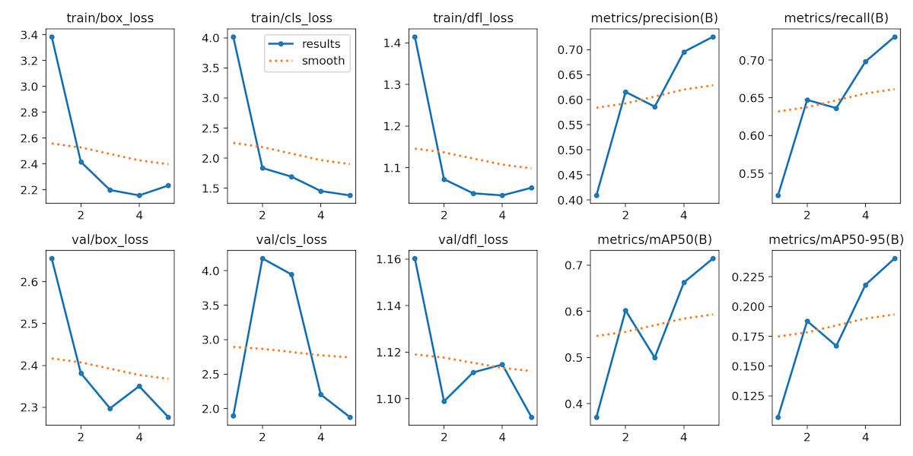
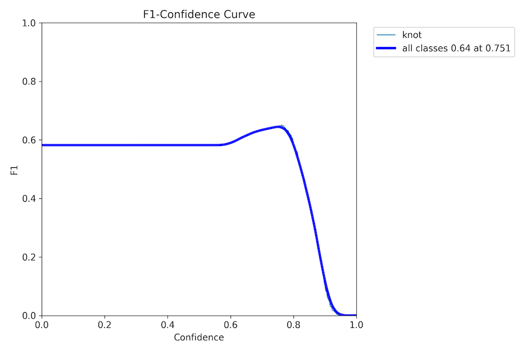

# Wood Knot counting on production line

Automatic counting of defects on fast production lines has numerous advantages.
Here I use YOLO architecure for cunting knots on wooden planks. 

Here is how the detection algorithm works in close-up:  

Full video with prediction results: https://vimeo.com/921840397

## 4nerds
Model specs:
- u/yolov8l trained for 1hr
- 40 labeled frames
- almost no augmentations

Interference specs:
- NVIDIA T4 0.7sec/frame
- up to 100 detections per image

Training process:

F1 curve

